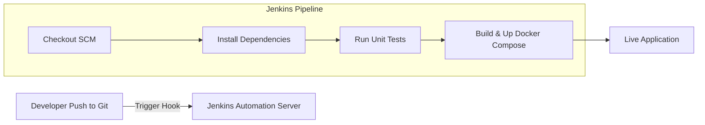

# Presentation Guide: Containerized AI Career Recommendation Platform with Jenkins CI/CD Automation

This guide compiles all the technical details, implementation steps, and architecture patterns of the **CHOOSEEASY** platform. Use this document to prepare your slides, present your work to examiners, and answer potential viva/presentation questions.

---

## 1. Executive Summary

**CHOOSEEASY** is an AI-powered career counseling and roadmap platform designed to bridge the gap between self-assessment and actionable career development. 
- **The Core Problem**: Traditional career assessments stop at recommending a job category (e.g. "Technology"). They fail to provide a clear, step-by-step roadmap or customize results to the user's specific lifestyle goals (e.g. remote work, specific salary brackets, or focus areas).
- **The Solution**: CHOOSEEASY uses a multi-stage testing framework (Psychometric, Technical, Aptitude) combined with an advanced **Generative AI Microservice (Gemini API)** to map out a highly customized, phase-by-phase career transition roadmap complete with skill milestones, portfolio projects, certifications, salaries, and automation risk analysis.
- **The DevOps Edge**: The entire platform is built with DevOps best practices: containerized using **Docker Compose** for consistent cross-environment execution, automated via a **Jenkins CI/CD Pipeline** for continuous integration/continuous deployment, and managed using advanced Git branch workflows.

---

## 2. Platform Architecture

The platform follows a **decoupled microservices architecture** orchestrated via a single Docker network.

```mermaid
graph TD
    Client[React.js Frontend Client] -->|HTTP REST APIs| Server[Node.js / Express Backend Server]
    Server -->|Read/Write| MongoDB[(MongoDB Database)]
    Server -->|Delegate Analysis| AIService[Python / Flask AI Microservice]
    AIService -->|HTTPS Requests| Gemini[Google Gemini 1.5 Flash API]

    subgraph Docker Containerized Network (chooseeasy-network)
        Client
        Server
        MongoDB
        AIService
    end
```

### Components and Technologies:
1. **Frontend Client (React.js + Tailwind CSS)**
   - Single Page Application (SPA) providing an interactive, responsive user experience.
   - Assessment modules (Intro -> Psychometric Quiz -> Technical Quiz -> Aptitude Quiz -> Results).
   - User dashboard displaying test history, contribution activity (calendar tracker), and saved roadmaps.
2. **Backend Server (Node.js + Express.js)**
   - API Gateway responsible for routing, user authentication (JWT-based), and test score logging.
   - Communicates with MongoDB using Mongoose ODM.
   - Proxies complex AI analysis requests to the Python microservice.
3. **AI Microservice (Python + Flask)**
   - Dedicated Python service containing prompt engineering templates and API wrappers.
   - Interacts with **Google Gemini 1.5 Flash** using lightweight HTTPS request payloads.
   - Cleans, parses, and structures response data into verified JSON.
4. **Database (MongoDB)**
   - Stores collections for `Users`, `Careers`, `Questions`, `TestResults`, `Feedback`, and `Contact`.
   - Integrates the AI career intelligence report directly inside the `TestResult` schema.

---

## 3. The DevOps & CI/CD Pipeline

DevOps is the backbone of this project's deployment strategy, focusing on automation, scalability, and environmental consistency.



### Key DevOps Integrations:

1. **Docker Containerization**
   - **Frontend Dockerfile**: Multi-stage build that compiles Vite/React files and serves them via an Nginx web server for production efficiency.
   - **Backend Dockerfile**: Installs Node modules and runs the Express API server on port 5000.
   - **AI Service Dockerfile**: Uses a slim Python base image, installs lightweight dependencies (`Flask`, `requests`), and runs via Gunicorn WSGI server.
2. **Multi-Container Orchestration (Docker Compose)**
   - Manages four concurrent services: `mongodb`, `server`, `ai-service`, and `client`.
   - Isolates container traffic inside a custom bridge network (`chooseeasy-network`).
   - Ensures correct launch order via `depends_on` hooks (Client and Server start after AI-Service and MongoDB).
3. **Jenkins CI/CD Pipeline (`Jenkinsfile`)**
   - **Stage 1: Checkout**: Pulls the latest commits from GitHub.
   - **Stage 2: Install Server/Client Dependencies**: Runs `npm install` for both layers.
   - **Stage 3: Testing**: Executes Jest test scripts on client and server codebase to verify build stability.
   - **Stage 4: Deploy (Docker Compose)**: Executes `docker-compose down` followed by `docker-compose up -d --build` to automatically deploy container updates without service downtime.

---

## 4. AI Recommendation Module: Deep Dive

The AI module uses **Gemini 1.5 Flash** to provide industry-grade career mapping.

### How It Works:
1. **Rule-Based Pre-filtering**:
   - The user completes the 3-stage quiz. The frontend evaluates psychometric responses to assign a matching domain (e.g. Technology, Business, Creative).
   - Technical questions are customized to this matched domain, and general aptitude is scored.
2. **On-Demand AI Triggering**:
   - Upon viewing results, the user can input their customized goals (e.g., "I want to work remotely in India", "I prefer python over javascript", "I want a high-paying job but dislike mathematics").
   - Clicking **Generate AI Roadmap** triggers the backend to bundle user answers, category scores, rule-based recommendations, and their custom wishes into a structured payload.
3. **Prompt Engineering & Structured JSON**:
   - The Python service sends a highly structured prompt to Gemini instructing the LLM to act as a certified career counselor.
   - The LLM is forced to output a strictly formatted JSON structure (not Markdown text) using Gemini's `responseMimeType: "application/json"` parameter.
4. **Data Delivery & Rendering**:
   - The backend stores the JSON object directly into the user's `TestResult` schema, ensuring persistence.
   - The frontend renders this object in a visual layout:
     - **Compatibility Gauge**: Radial progress bar showing overall profile symmetry.
     - **Milestone Timeline**: 3 distinct phases mapping core skills, certifications, and portfolio projects.
     - **Job Cards**: Exact role titles and definitions.
     - **Market Outlook**: India vs. Global salary ranges, growth trajectory, and automation index.
     - **Wishes Match**: Custom coaching tips responding to the user's wish inputs.

---

## 5. Presentation Slides Structure (Suggested)

Use this outline to create a PowerPoint deck:

- **Slide 1**: Title (Project name, your name, division, advisor name).
- **Slide 2**: Introduction & Objectives (What is CHOOSEEASY? What challenges does it address?).
- **Slide 3**: Traditional vs. AI Career Advising (Why simple rule-based testing is insufficient, and how Generative AI updates this).
- **Slide 4**: System Architecture (Show the frontend, backend, AI microservice, database layout).
- **Slide 5**: Microservices in Action (Show the role of the Python AI Flask service and how it parses Gemini API).
- **Slide 6**: DevOps Implementations (Docker Compose setup, container separation, ports, network).
- **Slide 7**: CI/CD Pipeline (Explain the Jenkins stages: Checkout -> Install -> Test -> Deploy).
- **Slide 8**: Interactive UI Showcase (Screen captures of Dashboard, contribution tracker, AI detailed roadmap views).
- **Slide 9**: Key Advantages (Scalable, containerized, real-time AI updates, user profile tracking).
- **Slide 10**: Future Scope & Conclusion (Adding real-time job listings, automated resume reviews, cloud deployment).

---

## 6. Likely Presentation/Viva Questions and Answers

### Q1: Why did you build a separate Python microservice instead of calling Gemini directly from Node.js?
* **Answer**: 
  1. **Separation of Concerns**: Keep the core Node.js server lightweight for user management, routes, and authentication. Keep the AI logic separate.
  2. **Scalability**: AI processing can be resource-intensive. Running it as a microservice means we can scale the AI container independently from the web backend.
  3. **Industry Best Practice**: Python is the standard language for AI/ML tasks. By establishing a Python service, we can easily integrate local machine learning models or Scikit-Learn components in the future.

### Q2: What is the benefit of using Docker Compose in this project?
* **Answer**: Docker Compose allows us to define and run a multi-container application with a single command. It eliminates the "works on my machine" problem by bundling node, python, database, and web server dependencies into exact container versions. It also sets up isolated bridge networks automatically so our services can communicate securely using hostnames (e.g. `http://ai-service:5001`) instead of local IP addresses.

### Q3: How does the Jenkins CI/CD pipeline improve the software life cycle?
* **Answer**: It implements **Continuous Integration** and **Continuous Deployment**. When a developer pushes code to GitHub, Jenkins automatically runs the pipeline: checking out code, installing dependencies, and running tests. If tests pass, it deploys the container updates immediately using Docker Compose. This reduces manual deployment steps, catches bugs early via automated tests, and ensures the live server is always running the latest stable build.

### Q4: How do you handle Gemini API key security in your DevOps pipeline?
* **Answer**: We avoid hardcoding credentials in the code. We store the API key as an environment variable (`GEMINI_API_KEY`) within the server and AI services. In production, Jenkins or Docker Compose passes these environment keys securely. For the presentation demo, we also have a fallback key setup to ensure smooth, zero-configuration execution.

### Q5: How did you handle Gemini output format inconsistency?
* **Answer**: By using Gemini's new structured output capabilities (`responseMimeType: "application/json"`) in the Python payload, we force the AI to return data in a strict JSON format. We also implemented a cleaning helper in Python (`app.py`) to strip any markdown wrappers (like ` ```json ` blocks) and run standard JSON parsing before sending it back, ensuring it never crashes the frontend.
